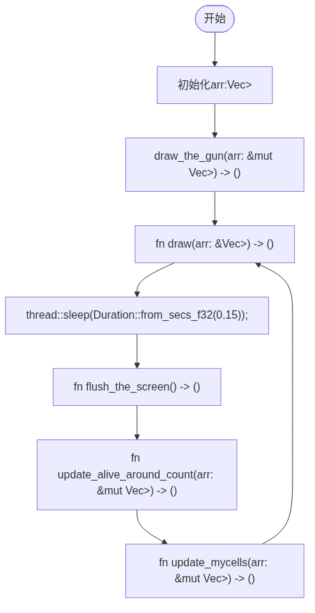

:PROPERTIES:
:ID:       a8ecce4c-7858-48cc-a761-5b10d2b188aa
:END:
#+title: 自制康威生命游戏(高斯帕机枪)
#+date: 2026-08-16 14:48
#+filetags:
#+STARTUP: inlineimages
* 简介
康威生命游戏（英语：Conway's Game of Life），又称康威生命棋,是英国数学家约翰·何顿·康威在1970年发明的细胞自动机.
它最初于1970年10月在《科学美国人》杂志上马丁·葛登能的“数学游戏”专栏出现.
* 核心规则
每个细胞有两种状态- 存活或死亡，每个细胞与以自身为中心的周围八格细胞产生互动（如图，黑色为存活，白色为死亡）
- 当前细胞为存活状态时，当周围的存活细胞低于2个时（不包含2个），该细胞变成死亡状态。（模拟生命数量稀少）
- 当前细胞为存活状态时，当周围有2个或3个存活细胞时，该细胞保持原样。
- 当前细胞为存活状态时，当周围有超过3个存活细胞时，该细胞变成死亡状态。（模拟生命数量过多）
- 当前细胞为死亡状态时，当周围有3个存活细胞时，该细胞变成存活状态。（模拟繁殖）
* 代码实现
** (核心) fn main()
- 核心的程序循环所在处
#+begin_src rust
  fn main() {
      // init an 2D vector
      let cols: usize = 40;
      let rows: usize = 100;
      let mut arr: Vec<Vec<MyCell>> = (0..cols)
          .map(|_| {
              (0..rows)
                  .map(|_| MyCell {
                      is_alive: false,
                      alive_around_cnt: 0,
                  })
                  .collect()
          })
          .collect();

      // draw the gun(绘制"高斯帕机枪")
      draw_the_gun(&mut arr);

      // start the main loop("开始进行核心主循环")
      loop {
          draw(&arr);
          thread::sleep(Duration::from_secs_f32(0.15));
          flush_the_screen();
          update_alive_around_count(&mut arr);
          update_mycells(&mut arr);
      }
  }
#+end_src
** (核心) struct MyCell
- is_alive: true->当前细胞存活,flase->当前细胞死亡;
  alive_around_cnt->当前细胞周围的存活细胞数量;
#+begin_src rust
struct MyCell {
    is_alive: bool,
    alive_around_cnt: usize,
}
#+end_src
** fn draw_the_gun(arr: &mut Vec<Vec<MyCell>>) -> ()
- 绘制高斯帕机枪
#+begin_src rust
fn draw_the_gun(arr: &mut Vec<Vec<MyCell>>) -> () {
    let directions: [(usize, usize); 36] = [
        (24, 0),
        (22, 1),
        (24, 1),
        (12, 2),
        (13, 2),
        (20, 2),
        (21, 2),
        (34, 2),
        (35, 2),
        (11, 3),
        (15, 3),
        (20, 3),
        (21, 3),
        (34, 3),
        (35, 3),
        (0, 4),
        (1, 4),
        (10, 4),
        (16, 4),
        (20, 4),
        (21, 4),
        (0, 5),
        (1, 5),
        (10, 5),
        (14, 5),
        (16, 5),
        (17, 5),
        (22, 5),
        (24, 5),
        (10, 6),
        (16, 6),
        (24, 6),
        (11, 7),
        (15, 7),
        (12, 8),
        (13, 8),
    ];
    for (dr, dc) in directions {
        set_seeds_alive(arr, dr + 2, dc + 25);
    }
}  

#+end_src
** fn draw(arr: &Vec<Vec<MyCell>>) -> ()
- 绘制"一次"当前的生命游戏图("O"表示存活细胞,"-"表示死亡细胞)
#+begin_src rust
// draw the current cells' status
fn draw(arr: &Vec<Vec<MyCell>>) -> () {
    for i in arr {
        for j in i {
            match j.is_alive {
                true => print!("O"),
                false => print!("-"),
            }
        }
        print!("\n");
    }
}
#+end_src
** thread::sleep(Duration::from_secs_f32(0.15))
- 就是让当前的程序停止0.15秒再运行,防止"draw()"
  还没在终端画完所有字符就继续执行了
#+begin_src rust
thread::sleep(Duration::from_secs_f32(0.15));
#+end_src
** fn flush_the_screen() -> ()
- 向终端写入"\x1B[2J\x1B[H"清空屏幕并把光标移动到左上角
#+begin_src rust
  fn flush_the_screen() -> () {
      print!("\x1B[2J\x1B[H");
  }
#+end_src
** fn update_alive_around_count(arr: &mut Vec<Vec<MyCell>>) -> ()
- 遍历arr,更新arr中每个MyCell(细胞)周围的存活细胞数并存入MyCell结构体
  的"alive_around_cnt"成员中,方便统一管理MyCell
#+begin_src rust
fn update_alive_around_count(arr: &mut Vec<Vec<MyCell>>) -> () {
    let max_cols: usize = arr.len() - 1;
    let max_rows: usize = arr[0].len() - 1;
    for i in 0..max_cols {
        for j in 0..max_rows {
            match count_cells_around(&arr, i, j) {
                -1 => continue,
                count => arr[i][j].alive_around_cnt = count as usize,
            }
        }
    }
}
#+end_src
** fn update_mycells(arr: &mut Vec<Vec<MyCell>>) -> ()
- 遍历arr,根据MyCell结构体中的"alive_around_cnt"和
  "is_alive"判断"下一代"时当前细胞的"is_alive"状态
#+begin_src rust
fn update_mycells(arr: &mut Vec<Vec<MyCell>>) -> () {
    let max_cols: usize = arr.len() - 1;
    let max_rows: usize = arr[0].len() - 1;
    for i in 0..max_cols {
        for j in 0..max_rows {
            match arr[i][j].is_alive {
                true => {
                    if arr[i][j].alive_around_cnt < 2 {
                        arr[i][j].is_alive = false;
                    } else if arr[i][j].alive_around_cnt > 3 {
                        arr[i][j].is_alive = false;
                    }
                }
                false => {
                    if arr[i][j].alive_around_cnt == 3 {
                        arr[i][j].is_alive = true;
                    }
                }
            }
        }
    }
}
#+end_src
* 程序流程图
#+begin_src mermaid :file flowchart.png
flowchart TD
  A([开始]) --> B["初始化arr:Vec<Vec<MyCell>>"]
  B --> C["draw_the_gun(arr: &mut Vec<Vec<MyCell>>) -> ()"]
  C --> D["fn draw(arr: &Vec<Vec<MyCell>>) -> ()"]
  D --> E["thread::sleep(Duration::from_secs_f32(0.15));"]
  E --> F["fn flush_the_screen() -> ()"]
  F --> G["fn update_alive_around_count(arr: &mut Vec<Vec<MyCell>>) -> ()"]
  G --> H["fn update_mycells(arr: &mut Vec<Vec<MyCell>>) -> ()"]
  H --> D
#+end_src
- 求值结果
#+RESULTS:

